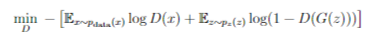
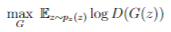
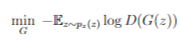

# Image Dehazing Using Redisual Blocks and Surface Smoothness Regularization Loss

In this project, I present an improved method for single-image dehazing utilizing Residual Generative Adversarial Networks (GANs). My approach integrates a decaying learning rate strategy and introduces a novel regularization loss, which I term Surface Regularization Loss. Traditional dehazing techniques often suffer from residual artifacts and fail to generalize well across diverse haze conditions. To address these limitations, I propose a Residual GAN architecture that leverages the Surface Regularization Loss, which works by taking higher-order derivatives of the plane surface to effectively reduce artifacts and enhance image smoothness. The decaying learning rate further ensures stable and efficient convergence of the model, allowing it to adapt dynamically during the training process. Extensive experiments conducted on the RESIDE benchmark dataset demonstrate that my method significantly outperforms existing state-of-the-art techniques in terms of both quantitative metrics (PSNR, SSIM) and visual quality. The proposed model exhibits superior generalization capabilities, providing clear and artifact-free dehazed images under various challenging conditions. These advancements highlight the potential of my Residual GAN framework as a robust solution for single-image dehazing.

## Introduction

Image dehazing is crucial in computer vision, as it significantly affects both human
perception and machine tasks. Hazy conditions caused by particles such as dust,
fog, or smoke scatter light, which results in reduced visibility and contrast. This
degradation has a substantial impact on various applications, including surveillance,
autonomous driving, remote sensing, and photography.
To address these challenges, image dehazing models are employed to restore the
clarity and detail of hazy images. The formation of a hazy image can be modeled
by the following equation:

I(x) = J(x)t(x) + A(1 − t(x)) (1.1)

In this model:

• I(x) represents the observed intensity of the hazy image
• J(x) denotes the scene radiance or the true image without haze,
• A is the global atmospheric light, which is the light scattered by the atmo-
sphere,
• t(x) is the medium transmission, indicating the fraction of light that is not
scattered and directly reaches the camera.

The formula illustrates how the hazy image I(x) is a combination of the true scene
radiance J(x) and the effects of scattering and atmospheric light. The challenge of
haze removal is to estimate J(x) by effectively separating it from the haze compo-
nents.

Recent advancements in deep learning, particularly Generative Adversarial Networks
(GANs), have revolutionized image restoration tasks. GANs excel at generating
high-quality images and learning complex mappings, making them particularly well-
suited for dehazing tasks where the relationship between hazy and clear images is
nonlinear and context-dependent.

## GAN-based approaches

Generative Adversarial Networks (GANs) have been widely employed for various
image-to-image translation tasks due to their powerful generative capabilities. In
the context of image dehazing, GANs can effectively learn the complex mapping
from hazy images to clear images, making them particularly suitable for this task.
Several key GAN-based approaches have been proposed for image dehazing, each
with unique architectures and mechanisms to enhance performance
Discriminator

The discriminator D(x) aims to distinguish between real data and data generated
by the generator. The objective function for the discriminator is:

 .. (3.1)

where:

• Ex∼pdata(x) log D(x) is the expectation over real data samples. It encourages
the discriminator to assign high probabilities to real samples.
Chapter III. Literature Review 10
• Ez∼pz (z) log(1 − D(G(z))) is the expectation over noise inputs to the generator.
It encourages the discriminator to assign low probabilities to fake samples
produced by the generator.
Generator

The generator G(z) aims to generate samples that are indistinguishable from real
data. The objective function for the generator is:

 .. (3.2)

or equivalently:

 .. (3.3)

where:
Ez∼pz (z) log D(G(z)) denotes the expectation over the noise distribution pz (z).
This term encourages the generator to produce samples that the discriminator
classifies as real.